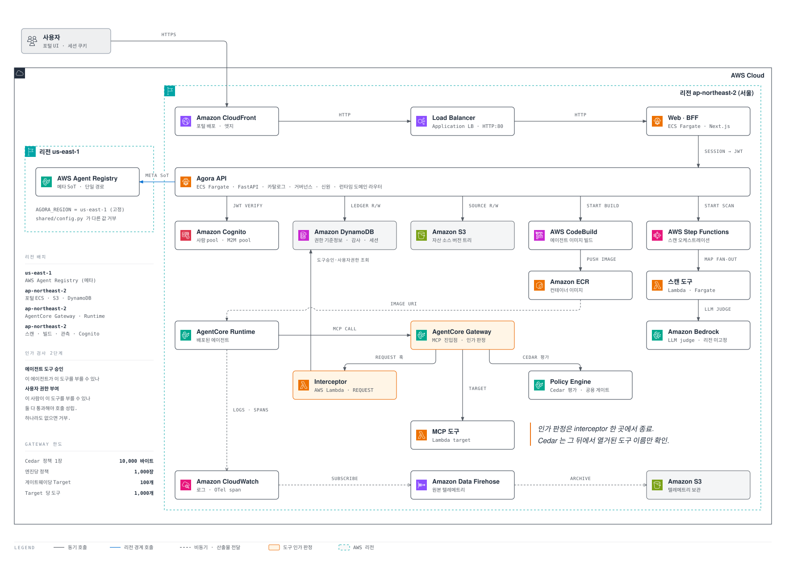

# Agora: AgentCore 거버넌스 포털

## 전체 아키텍처



메타 SoT(AWS Agent Registry)는 `us-east-1`, 나머지 전부 `ap-northeast-2`(서울) 배치. 도구 인가
판정은 AgentCore Gateway 의 REQUEST interceptor 한 곳에서 종료.

## 한 바퀴

등록에서 시작해 스캔·승인·배포를 지나 호출로 종료.

1. 등록자가 자산을 올리면 AWS Agent Registry 에 레코드 생성, 승인 큐 진입.
2. 거버넌스 파이프라인이 보안 스캔 수행. 시크릿(gitleaks) · SAST(semgrep) · 취약점(trivy) ·
   LLM 심사를 Step Functions 가 오케스트레이션하고 Lambda 와 Fargate 가 실행.
3. 관리자가 게이트 결과를 보고 승인하면 자산이 카탈로그에 노출.
4. MCP 는 Lambda + AgentCore Gateway Target 으로, Agent 는 AgentCore Runtime 으로 배포.
5. 배포된 agent 의 도구 호출을 Gateway REQUEST interceptor 가 판정.

## 도구 인가는 두 층

| 층 | 질문 | 저장 위치 |
| --- | --- | --- |
| 에이전트 도구 승인 | 이 agent 가 이 도구를 부를 수 있나 | Identity 원장 (DynamoDB) |
| 사용자 권한 부여 | 이 사람·그룹이 이 자산의 이 작업을 부를 수 있나 | Identity 원장, `(subject, asset_id, operation_id)` 키 |

두 층 다 fail-closed. 승인 레코드가 없으면 거부하고 거부 이유를 호출자에게 그대로 반환
(`tool_not_approved`, `tool_pending_approval`, `human_grant_missing`).

Cedar 정책은 Gateway 인프라의 일부. agent 를 하나 더 배포해도 정책 수는 불변. Gateway 당 정책
한 장이 선언된 도구 이름(`${target}___${tool}`)을 열거하고, agent 별 차이는 원장이 결정.
agent 신원(`client_id`)은 정책 문장에 미포함.

판정 지점은 interceptor 하나. Cedar 는 그 뒤에서 interceptor 가 다시 쓴 본문을 평가하므로,
독립적인 2차 방어선으로 취급 금지.

## 저장소 구조

```
api/      FastAPI 백엔드. 도메인별 패키지(catalog, governance, identity, runtime,
          playground, monitoring, bundle, evaluation)와 공용 DI(shared/deps.py)
web/      Next.js 16 포털. 사용자 화면((portal))과 관리자 콘솔((console)/admin)
infra/    AWS CDK. 스택 8종, 스캔 도구 컨테이너, Gateway 타깃 Lambda
```

도메인 경계가 오너십 경계. 한 도메인이 다른 도메인을 직접 import 하지 않고, 공유가 필요하면
`api/src/agora/shared/` 로 승격. 카탈로그 상태 접근은 `RegistryPort`, `SourceStorePort`,
`shared.deps` 접근자 경유.

### CDK 스택

| 스택 | 담당 |
| --- | --- |
| `AgoraCatalogStorage` | 카탈로그 DynamoDB·S3, API 실행 롤 |
| `AgoraGovernanceScan` | 스캔 Step Functions, 스캔 버킷 |
| `AgoraGovernanceScanTools` | gitleaks, semgrep, trivy, LLM 심사 실행체 |
| `AgoraRuntimeDeploy` | MCP·Agent 배포 파이프라인, CodeBuild, 실행 롤, permission boundary |
| `AgoraIdentity` | 사람 Cognito 풀, 세션 테이블, Identity 원장 |
| `AgoraM2OAuthGateway` | AgentCore Gateway, Cedar policy engine, REQUEST interceptor |
| `AgoraRuntimeAuthorization` | Runtime 인가 Lambda (Function URL, `AuthType=AWS_IAM`) |
| `AgoraPortal` | ECS Fargate + ALB + CloudFront 호스팅 (`-c portal=true` 일 때만) |

`AgoraMonitoringAggregate` 와 `AgoraTelemetryArchive` 는 컨텍스트 플래그로 켜는 선택 스택.

## Gateway 한도

| 항목 | 한도 |
| --- | --- |
| Cedar 정책 1장 | 10,000 바이트 |
| 엔진당 정책 | 1,000장 |
| 게이트웨이당 Target | 100개 |
| Target 당 도구 | 1,000개 |

## 안전 기본값

배포 전 확인 항목 네 가지. 안전한 쪽이 기본값이고, 되돌리려면 명시적 플래그 필요.

Gateway policy engine 은 `ENFORCE` 가 기본. `LOG_ONLY` 는 `-c m2OAuthGatewayMode=LOG_ONLY`
명시 시에만 적용. `LOG_ONLY` 에서 관측한 "거부 0건" 은 강제가 켜져 있다는 증거가 아님.

REQUEST interceptor 도 기본 부착. `-c m2OAuthInterceptor=off` 로만 분리 가능. interceptor 의
가용성이 곧 Gateway 의 가용성이므로, 삭제·IAM 권한 제거·reserved concurrency 축소는 도구 인가
전면 중단으로 직결.

Runtime 인가 Function URL 은 `AuthType=AWS_IAM` 유지 필수. Lambda 리소스 정책의 principal 이
`"*"` 이면 안 됨. 합성된 `AWS::Lambda::Permission` 과 실제 리소스 정책을 배포 전 양쪽 확인.

Cognito 도메인 접두어는 전역 유일. 그래서 접두어를 `<base>-<stage>-<accountId>` 로 파생.
기존 배포의 접두어 보존이 필요하면 `-c cognitoDomainPrefix:<purpose>:<stage>=<prefix>` 주입.

AWS 좌표(계정, 풀 ID, Gateway ID, 테이블명)는 소스에 없음. 전부 환경변수 또는 CDK 컨텍스트로
주입하고, 누락 시 부팅·합성 실패. `api/.env.example` 과 `web/.env.example` 이 그 계약의 템플릿.

## 계정 선행조건

CDK 가 만들어 주지 않는 계정·리전 수준 설정 넷. 빠지면 스택이 CREATE_FAILED 로 죽거나 포털
기능이 조용히 막힘. 명령은 [QUICKSTART.md](QUICKSTART.md#계정-선행조건).

| 항목 | 없을 때 |
| --- | --- |
| X-Ray trace segment destination = CloudWatch Logs | `AgoraM2OAuthGateway` 와 `AgoraMonitoringAggregate` 생성 실패 |
| VPCs per Region 쿼터 8 이상 | `AgoraPortal` 의 VPC 생성 실패 |
| Cognito 사람 사용자 2명 이상 | 퍼블리시 폼의 2차 담당자를 채울 수 없어 등록 불가 |
| semgrep 스캐너 이미지 ECR push | SAST 단계가 컨테이너 pull 실패로 종료 |

## 시작하기

[QUICKSTART.md](QUICKSTART.md): 검증 명령, `cdk synth`, 로컬 실행, 계정 배포 절차.

## 사용 범위

AWS 고객 참조용 코드. 그대로 프로덕션 반영하지 말고, 위 안전 기본값을 확인한 뒤 각 계정의 보안
요구사항에 맞춰 검토 필요.
